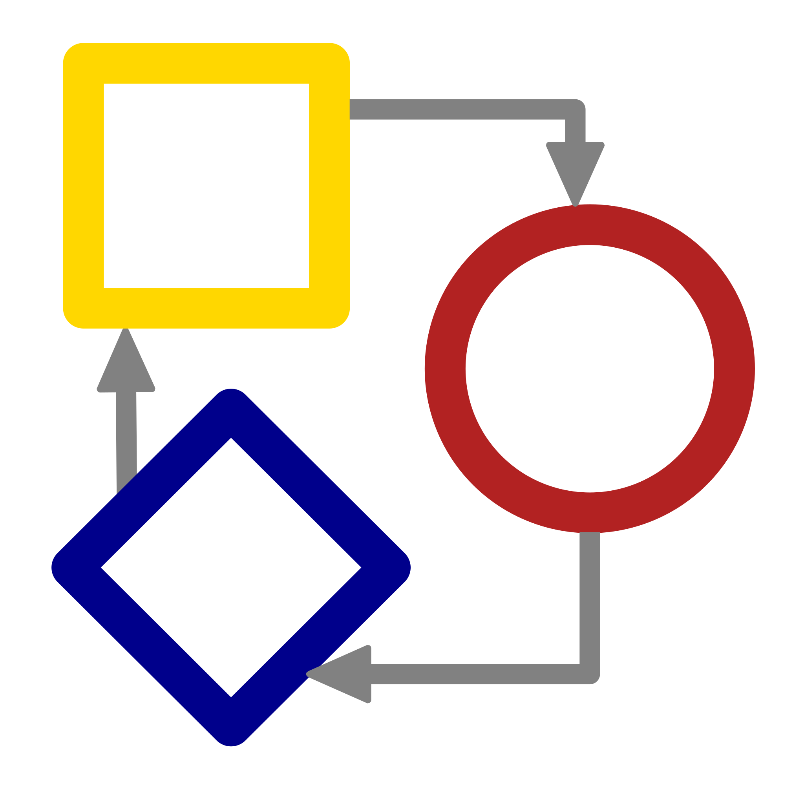

# wxRuby3/Shapes - A wxRuby3 2D shapes and diagramming framework

## Introduction

**wxRuby3/Shapes** (Wx::SF) is a pure Ruby software library/framework based on wxRuby3 which allows
easy development of software applications manipulating graphical objects (shapes) like various CASE 
tools, technological processes modeling tools, etc. This library is a pure Ruby implementation based
on the excellent [wxShapeFramework](https://sourceforge.net/projects/wxsf/) C++ library based on 
wxWidgets.

The library consists of several classes encapsulating a so called 'Shape canvas' (visual
GUI control used for management of diagrams) providing the following features:

- Create charts (diagrams) interactively in your wxRuby3 applications
- Serialize/deserialize charts to file or any io stream in multiple formats (currently supported formats are JSON and YAML)
- Support for Clipboard operations (Cut/Paste) and Drag&Drop of diagram components (shapes)
- Support for Undo/Redo operations
- Support for alignment of diagram components.
- Support for printing of diagrams (including preview)
- Support for diagram export to bitmap (any supported type)
- Support for Thumbnail view of diagram
- A standard collection of diagram components
  - Shapes: basic rectangular, square, circle, ellipse, rounded rectangle, grid, flexible grid, text, editable text, polygonal, diamond, bitmap
  - Lines: straight, curved, orthogonal, rounded orthogonal
  - Line arrows: solid, open, diamond, circle
- Highly customizable and extendable

The shape framework (and shape canvas) allows to define the relationship between various
shape types (for example which shape can be a child of another one, which shape types
can be connected together by which connection type, how do various connections look
like, etc) and provides an extensive set of events for customizing the interactive creation 
of diagrams.

More over, the library source code is pure Ruby based on wxRuby3 GUI toolkit, so it will
run on any platform that supports Ruby and wxRuby3.

## wxRuby3/Shapes licence

wxruby3/shapes is free and open-source. It is distributed under the liberal
MIT licence which is compatible with both free and commercial development.
See [LICENSE](LICENSE) for more details.

See the [wxRuby3](https://github.com/mcorino/wxRuby3) project for more information
concerning licensing of wxRuby3.

### Required Credits and Attribution

Generally, neither wxRuby3 nor wxRuby3/Shapes require attribution, beyond
retaining existing copyright notices. 
See [here](CREDITS.md) for more details and acknowledgements.

## FAQ

### What platforms and operating systems are supported in wxRuby3/Shapes?

All platforms supporting Ruby and wxRuby3. See the [wxRuby3](https://github.com/mcorino/wxRuby3) 
project for more information 

### Where can I ask a question, or report a bug?

Use GitHUb Issues.

When asking a question, if something is not working as you expect,
please provide a *minimal*, *runnable* sample of code that demonstrates
the problem, and say what you expected to happen, and what actually
happened. Please also provide basic details of your platform, Ruby,
wxRuby3/Shapes, wxRuby and wxWidgets version, and make a reasonable effort 
to find answers in the archive and documentation before posting. People are mostly happy
to help, but it's too much to expect them to guess what you're trying to
do, or try and debug 1,000 lines of your application.
Very important also; do not use offensive language and be **polite**.

### How can I learn to use wxRuby3/Shapes?

The wxRuby3/Shapes API has a lot of features and takes some time to learn. 
The wxRuby3/Shapes distribution comes with several samples which illustrate how 
to use many specific parts of the API. Good one's to start with are the
basic samples (samples/sample1|2|3|4) which provide insights in various basic 
features. The samples also include a fairly advanced and complete diagramming
demo application showcasing most of the features of wxRuby3/Shapes.

Complete (more or less) wxRuby3/Shapes API documentation should be part of any
complete wxRuby3/Shapes build. This tends to focus on providing a reference
of all available modules, classes ad methods and how to use specific
classes and methods, rather than on how to construct an application
overall.
This documentation (for the latest release) is also available online
[here](https://mcorino.github.io/wxRuby3-shapes/index.html).

### How does wxRuby3/Shapes compare to wxShapeFramework?

**wxRuby3/Shapes** is not a straight port of wxShapeFramework although much of the structure is maintained 
with the following major implementation differences:

- wxRuby3/Shapes implements a totally different serialization scheme in which none of the XML serializer 
code has been ported. In fact wxRuby3/Shapes does not offer any XML serialization out of the box but instead 
provides a more adaptable implementation with (for now) two supported output formats; JSON and YAML.
- Related to this the internal management of shape references has been changed as well as this was tightly 
linked to the serialization implementation.
- The API has been Ruby-fied with respect to constant names, method names and argument passing and return
values.
- The ScaledDC class has been integrated with wxRuby3 and is not part of wxRuby3/Shapes.

In addition many small tweaks, improvements and also bugfixes have been implemented as part of the port. 

### I am getting an error trying to install wxRuby3/Shapes

Please double-check the [INSTALL](INSTALL.md) documents, and search issue archives. If
this doesn't help, please post your question using GitHub Issues.
